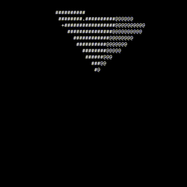

# Spinning Pyramid



A console-based animation of a rotating 3D pyramid rendered using ASCII characters. Pyramid smoothly rotates in terminal, with different characters representing each face to create a sense of depth and dimension.

## About

This project started as a rewrite inspired by the [ASMR Programming - Spinning Cube - No Talking](https://www.youtube.com/watch?v=p09i_hoFdd0) video. While the original showed a rotating cube, this version implements a pyramid.

## Building and Running

### Prerequisites

- C compiler (GCC, Clang)

### Compilation

Compilation with GCC:

```gcc
gcc pyramid.c -o pyramid -lm
```

Compilation with Clang:

```clang
clang pyramid.c -o pyramid -lm
```

### Running

```shell
./pyramid
```

## Configuration

You can modify various parameters in the header defines:

- `WIDTH` and `HEIGHT`: Screen dimensions
- `DISTANCE_FROM_CAM`: Camera distance
- `ROTATION_SPEED_X/Y/Z`: Rotation speeds for each axis
- `PROJECTION_FACTOR`: Perspective projection strength

## Contributing

Contributions are welcome! Feel free to:

- Open issues for bugs or feature requests
- Submit pull requests for improvements
- Suggest optimization ideas
- Add new features

This is an open project, and we appreciate any input that could make it even better.

## License

This project is open source and available under the MIT License.

## Acknowledgments

Special thanks to the creator of the original spinning cube video that inspired this project.